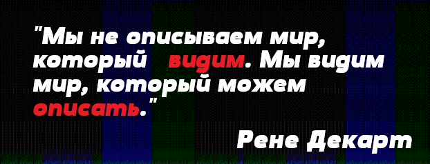
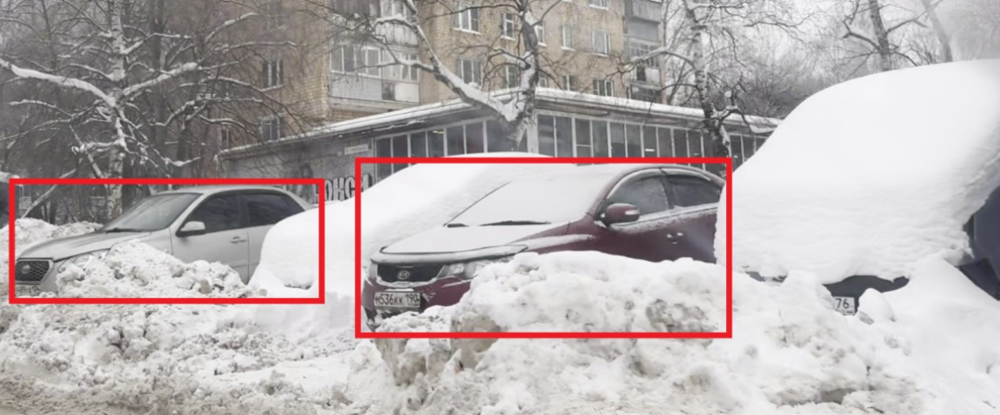
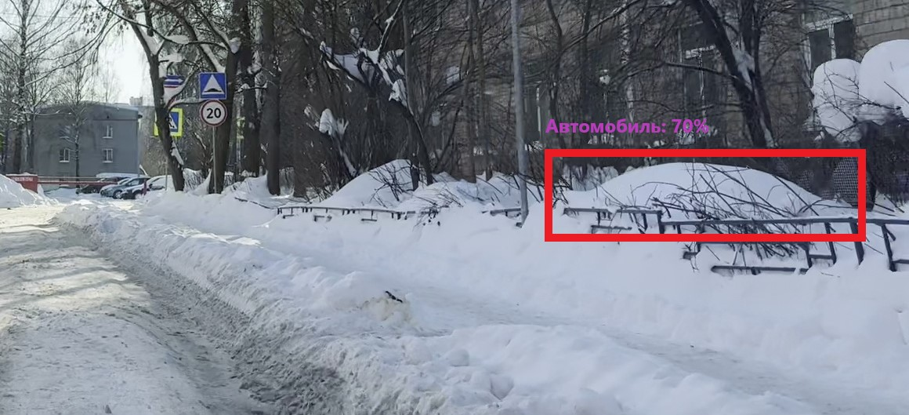

  

 

  
# Разработка системы мобильного мониторинга парковочных зон и реидентификации автомобилей на основе каскада глубоких нейронных сетей

&nbsp;&nbsp; Я думаю каждый житель мегаполиса часто сталкивается с проблемой поиска свободного места на парковке. 
&nbsp;&nbsp; Постоянное катание по дворам выматывает, тратит нервы, время, бензин, загрязняет воздух и как итог, не найдя места, многие бросают автомобили нарушая ПДД. 
&nbsp;&nbsp; Но, что если у нас появится возможность немного заглянуть в будущее и с большой уверенностью сказать, что
к моменту, когда я подъеду к парковке, у дома 45 место будет свободно? 
&nbsp;&nbsp;Звучит как чудо, но данный проект делает именно это.

  

  

  

<table>
  <tr>
    <td width="50%" valign="top">
  <strong> 
    
  ### `Цель проекта:` 
  </strong>  
      &nbsp;&nbsp;Создание программного комплекса, способного собирать статистику, и на её основе прогнозировать освобождение парковочных мест. 
      &nbsp;&nbsp;Такая система поможет не только быстрее находить парковку водителям, но и предоставит городским службам точные данные о загруженности улиц для принятия эффективных управленческих решений. 
    </td>
    <td width="50%" valign="top">

  <strong> 
    
  ### `Уникальность проекта:` 
  </strong>
&nbsp;&nbsp;В текущих условиях определение парковочных зон через спутниковую навигацию (GPS/ГЛОНАСС) является крайне нестабильным,
а установка стационарных камер сопряжена значительными капиталовложениями, что нецелесообразно для подтверждения эффективности самой концепции проекта. 
&nbsp;&nbsp;В связи с этим предлагаемая система использует исключительно анализ визуальных ориентиров из видеопотока
    </td>
  </tr>
</table>

### `Для достижения поставленной цели выполнены следующие шаги:`

1. Организован сбор видеоданных с мобильного устройства
2. Разработан алгоритм для обнаружения и уникальной идентификации автомобилей в кадре.
3. Создан механизм привязки распознанных машин к конкретным парковочным зонам на основе анализа видеопотока
4. Спроектирована база данных для хранения собранной статистики (ID автомобиля, парковочная зона, время прибытия/убытия)
5. Разработан программный прототип, объединяющий все созданные модули.
6. Проведено тестирование системы на реальных данных с оценкой точности ее работы.
7. Создана модель прогнозирования освобождения парковочных мест на основе накопленной статистики.

  
# Описание системы (история создания, исходный код)

### `Сбор видеоданных:` 

Сбор данных осуществлялся путем записи видео из движущегося автомобиля на смартфон 
На начальном этапе съемка велась с рук, что привело к получению данных низкого качества из-за тряски камеры и бликов лобового стекла. 
В будущем для решения проблемы было приобретено специально крепление для телефона 

Параметры собранных данных: 
  Общий обьем: 4 часа видеоматериала 
  Условия съемки: Записи в среднем по 10 минут, сделанные в разные дни, но в один период с 14:00 до 16:00 
  Технические характеристики: Разрешение: Full HD(1920x1080), частота кадров: 30 к/c

  

### `Создание модели детектирования автомобилей:`

Для задачи детектирования была выбрана готовая нейросетевая архитектура YOLO ver.11 
Данная модель уже предварительно обучена находить автомобили и изначально планировалось лишь дообучить ее для дополнительного обнаружения гос. номеров 

Однако в процессе работы выявилась серьезная проблема - погодные условия, а именно сильные снегопады, начавшиеся в момент сбора данных. 
Модель YOLO явно была не готова к такому сценарию: Снег часто скрывал значительную часть автомобиля, что приводило к большим ошибкам детектирования 

  

 
В связи с этим было принято решение разметить данные и дообучить модель под текущие условия 
Важной особенностью стало то, что для обучения целенаправленно использовались нечеткие кадры, полученные на начальном этапе при съемке с рук 
Такой подход позволил научить модель распознавать образы автомобилей даже когда изображение смазано или сильно перекрыто 

В итоге с помощью инструмента Roboflow было размечено 1200 кадров и 10000 объектов

### Исходный код: 
* **Функция раскадровки видео для дальнейшей разметки:** [video_storyboard.py](video_storyboard.py) 
* **Ссылка на размеченные данные roboflow:** [https://app.roboflow.com/tonik-cukag/parking_project-c66g3/train](https://app.roboflow.com/tonik-cukag/parking_project-c66g3/train)
* **Дообучение модели на новых данных:** [finetuning_models.ipynb](finetuning_models.ipynb) 

### `Ошибка модели:`

Буду честен. Дообучение на заснеженных улицах улучшило обнаружение, но породило новую проблему: ложные срабатывания 
Модель начала принимать крупные сугробы за автомобили, форма которых напоминает машину.

  

 
Попытка дополнительно дообучить модель на вырезанных кадрах ложного срабатывания не принесла успеха 
Модель по-прежнему соврешала ошибки и процесс превратился в замкнутый круг где исправление одной особенности приводило к ухудшению другой 
На данный момент проблема не решена
